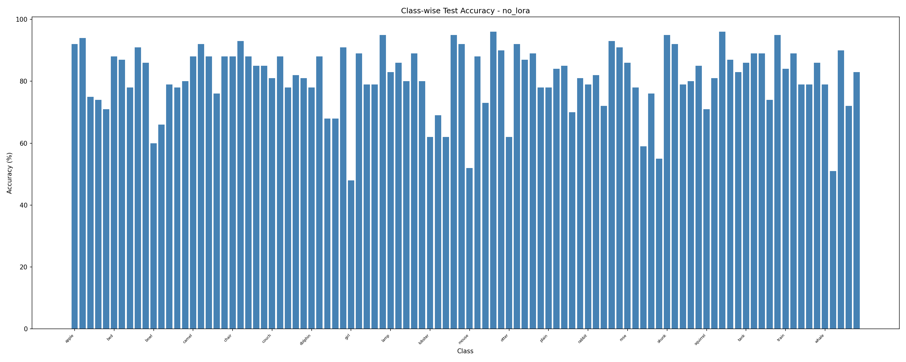
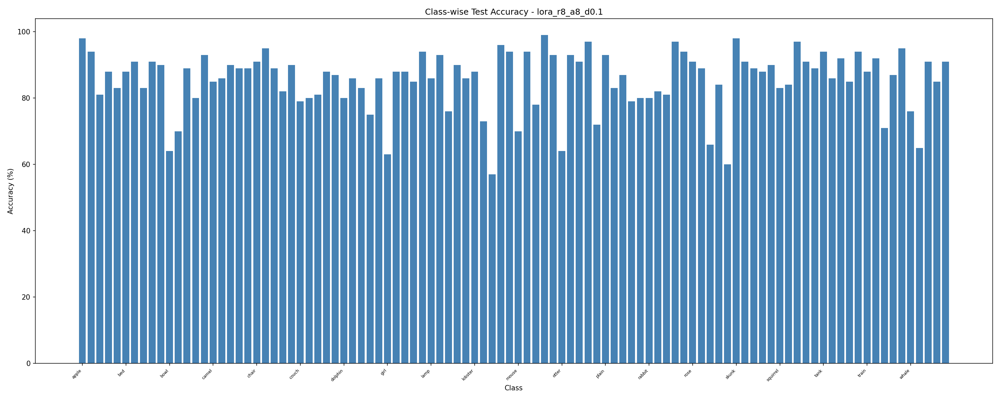
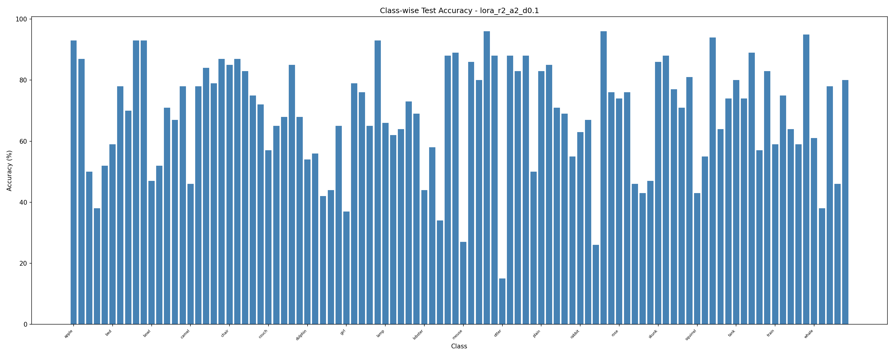
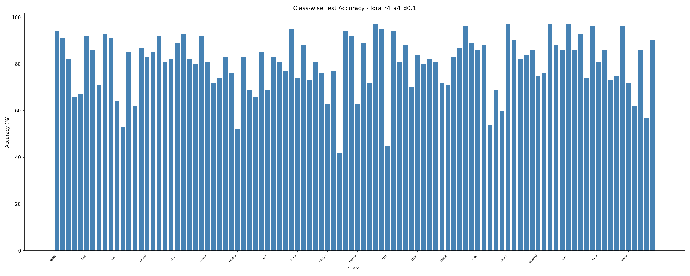
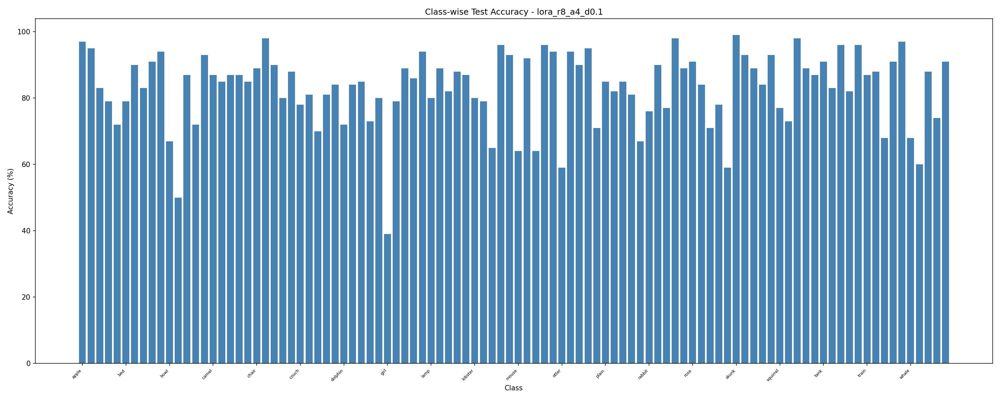
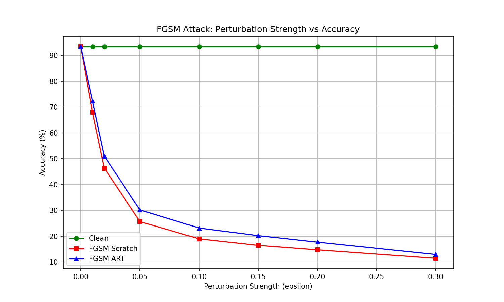
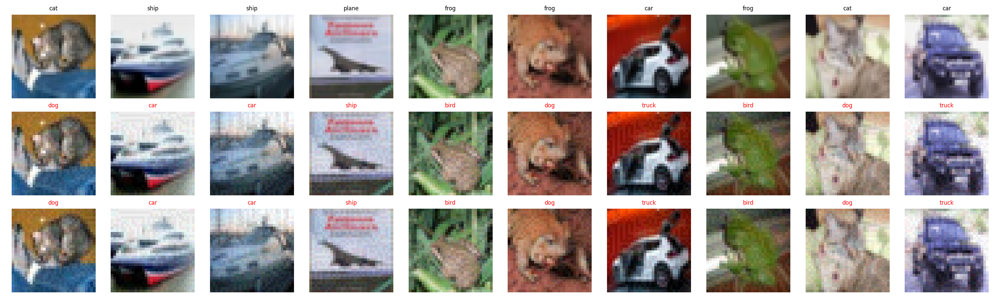
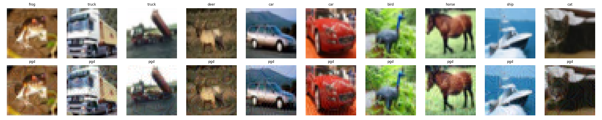

# Assignment 5 - MLOps (B22CS093)

## Links
- **WandB (Q1):** https://wandb.ai/b22cs093-prom-iit-rajasthan/vit-lora-cifar100
- **WandB (Q2):** https://wandb.ai/b22cs093-prom-iit-rajasthan/adversarial-cifar10
- **HuggingFace:** https://huggingface.co/Tron2703/vit-lora-cifar100

## Installation

### Using Docker (Recommended)
```bash
docker build -t assignment5 .
docker run --gpus all --env-file .env -v $(pwd)/weights:/app/weights -v $(pwd)/data:/app/data -it assignment5 bash
```

### Local Setup
```bash
pip install -r requirements.txt
```

Create a `.env` file:
```
WANDB_API_KEY=your-wandb-api-key
HF_TOKEN=your-huggingface-token
```

## Run All Experiments
```bash
bash run_all.sh
```

---

## Q1: ViT-S Fine-tuning with LoRA on CIFAR-100

### Training

```bash
# Without LoRA (head-only)
python q1/train.py --no_lora --epochs 10 --gpu 0

# With LoRA
python q1/train.py --rank 4 --alpha 4 --dropout 0.1 --epochs 10 --gpu 0

# All combinations
for rank in 2 4 8; do
    for alpha in 2 4 8; do
        python q1/train.py --rank $rank --alpha $alpha --dropout 0.1 --epochs 10 --gpu 0
    done
done
```

### Testing
```bash
python q1/test.py --no_lora --weights weights/no_lora_best.pth --gpu 0
python q1/test.py --rank 4 --alpha 4 --weights weights/lora_r4_a4_d0.1_best.pth --gpu 0
```

### Optuna Hyperparameter Search
```bash
python q1/optuna_search.py --n_trials 20 --gpu 0
```

### Push Weights to HuggingFace
```bash
python push_to_hf.py --repo_id Tron2703/vit-lora-cifar100
```

### Q1 Results

#### Test Results

| LoRA | Rank | Alpha | Dropout | Test Accuracy (%) | Trainable Params |
|------|------|-------|---------|-------------------|------------------|
| Without | - | - | - | 81.11 | 38,500 |
| With | 2 | 2 | 0.1 | 68.54 | 36,864 |
| With | 2 | 4 | 0.1 | 70.10 | 36,864 |
| With | 2 | 8 | 0.1 | 72.55 | 36,864 |
| With | 4 | 2 | 0.1 | 74.45 | 73,728 |
| With | 4 | 4 | 0.1 | 80.10 | 73,728 |
| With | 4 | 8 | 0.1 | 80.96 | 73,728 |
| With | 8 | 2 | 0.1 | 81.26 | 147,456 |
| With | 8 | 4 | 0.1 | 82.96 | 147,456 |
| **With** | **8** | **8** | **0.1** | **85.40** | **147,456** |

#### Per-Epoch Results: No LoRA

| Epoch | Train Loss | Val Loss | Train Acc (%) | Val Acc (%) |
|-------|-----------|----------|---------------|-------------|
| 1 | 1.0235 | 0.7360 | 73.82 | 79.54 |
| 2 | 0.5860 | 0.6770 | 82.76 | 80.72 |
| 3 | 0.5149 | 0.6661 | 84.46 | 80.68 |
| 4 | 0.4668 | 0.6640 | 85.66 | 81.08 |
| 5 | 0.4353 | 0.6552 | 86.70 | 81.12 |
| 6 | 0.4025 | 0.6525 | 87.65 | 81.24 |
| 7 | 0.3832 | 0.6436 | 88.13 | 81.68 |
| 8 | 0.3649 | 0.6415 | 88.84 | 81.58 |
| 9 | 0.3508 | 0.6375 | 89.36 | 81.38 |
| 10 | 0.3439 | 0.6379 | 89.51 | 81.40 |

#### Per-Epoch Results: LoRA R=2, A=2

| Epoch | Train Loss | Val Loss | Train Acc (%) | Val Acc (%) |
|-------|-----------|----------|---------------|-------------|
| 1 | 3.3436 | 2.3649 | 24.61 | 44.26 |
| 2 | 2.0346 | 1.8988 | 54.03 | 58.12 |
| 3 | 1.7212 | 1.7152 | 62.38 | 62.14 |
| 4 | 1.5637 | 1.6098 | 66.47 | 64.46 |
| 5 | 1.4661 | 1.5434 | 68.56 | 66.14 |
| 6 | 1.3970 | 1.4898 | 70.41 | 67.20 |
| 7 | 1.3501 | 1.4600 | 71.54 | 67.20 |
| 8 | 1.3164 | 1.4361 | 72.50 | 68.60 |
| 9 | 1.2928 | 1.4330 | 73.14 | 68.44 |
| 10 | 1.2820 | 1.4262 | 73.24 | 68.60 |

#### Per-Epoch Results: LoRA R=2, A=4

| Epoch | Train Loss | Val Loss | Train Acc (%) | Val Acc (%) |
|-------|-----------|----------|---------------|-------------|
| 1 | 3.0484 | 2.2490 | 32.78 | 51.02 |
| 2 | 1.8777 | 1.8658 | 59.44 | 60.22 |
| 3 | 1.6193 | 1.6975 | 65.23 | 64.00 |
| 4 | 1.4826 | 1.5806 | 68.56 | 66.54 |
| 5 | 1.3953 | 1.5206 | 70.70 | 68.02 |
| 6 | 1.3238 | 1.4590 | 72.45 | 69.82 |
| 7 | 1.2781 | 1.4350 | 73.72 | 70.24 |
| 8 | 1.2400 | 1.4100 | 74.41 | 70.54 |
| 9 | 1.2160 | 1.3966 | 75.04 | 70.60 |
| 10 | 1.2032 | 1.3923 | 75.56 | 70.86 |

#### Per-Epoch Results: LoRA R=2, A=8

| Epoch | Train Loss | Val Loss | Train Acc (%) | Val Acc (%) |
|-------|-----------|----------|---------------|-------------|
| 1 | 2.9794 | 2.0348 | 32.27 | 54.46 |
| 2 | 1.8107 | 1.6815 | 59.51 | 62.68 |
| 3 | 1.5556 | 1.5441 | 65.93 | 66.14 |
| 4 | 1.4142 | 1.4437 | 69.56 | 68.12 |
| 5 | 1.3280 | 1.3610 | 72.00 | 70.36 |
| 6 | 1.2637 | 1.3236 | 73.63 | 71.36 |
| 7 | 1.2106 | 1.2973 | 75.05 | 71.68 |
| 8 | 1.1703 | 1.2659 | 76.14 | 72.76 |
| 9 | 1.1426 | 1.2556 | 76.91 | 73.10 |
| 10 | 1.1268 | 1.2400 | 77.18 | 73.06 |

#### Per-Epoch Results: LoRA R=4, A=2

| Epoch | Train Loss | Val Loss | Train Acc (%) | Val Acc (%) |
|-------|-----------|----------|---------------|-------------|
| 1 | 3.3300 | 2.3193 | 24.78 | 44.68 |
| 2 | 1.8309 | 1.7354 | 57.22 | 59.68 |
| 3 | 1.4614 | 1.5082 | 67.11 | 66.12 |
| 4 | 1.2622 | 1.3512 | 71.93 | 68.94 |
| 5 | 1.1424 | 1.2695 | 74.80 | 72.14 |
| 6 | 1.0592 | 1.2207 | 76.72 | 72.80 |
| 7 | 1.0024 | 1.1756 | 78.21 | 73.64 |
| 8 | 0.9635 | 1.1571 | 79.18 | 74.38 |
| 9 | 0.9378 | 1.1415 | 79.80 | 74.56 |
| 10 | 0.9253 | 1.1408 | 80.21 | 74.70 |

#### Per-Epoch Results: LoRA R=4, A=4

| Epoch | Train Loss | Val Loss | Train Acc (%) | Val Acc (%) |
|-------|-----------|----------|---------------|-------------|
| 1 | 2.9392 | 1.8776 | 33.82 | 56.52 |
| 2 | 1.5459 | 1.3755 | 65.70 | 70.18 |
| 3 | 1.2223 | 1.1668 | 73.58 | 74.98 |
| 4 | 1.0521 | 1.0632 | 77.67 | 77.52 |
| 5 | 0.9503 | 0.9848 | 79.77 | 79.06 |
| 6 | 0.8804 | 0.9370 | 81.56 | 80.24 |
| 7 | 0.8288 | 0.9092 | 82.92 | 80.62 |
| 8 | 0.7908 | 0.8898 | 83.87 | 80.58 |
| 9 | 0.7689 | 0.8802 | 84.26 | 80.88 |
| 10 | 0.7575 | 0.8721 | 84.60 | 81.24 |

#### Per-Epoch Results: LoRA R=4, A=8

| Epoch | Train Loss | Val Loss | Train Acc (%) | Val Acc (%) |
|-------|-----------|----------|---------------|-------------|
| 1 | 2.6024 | 1.5670 | 41.99 | 66.30 |
| 2 | 1.2907 | 1.1959 | 72.12 | 73.74 |
| 3 | 1.0309 | 1.0728 | 77.72 | 75.56 |
| 4 | 0.9004 | 0.9566 | 80.67 | 78.76 |
| 5 | 0.8125 | 0.9151 | 82.69 | 79.26 |
| 6 | 0.7535 | 0.8754 | 83.99 | 79.46 |
| 7 | 0.7052 | 0.8534 | 85.37 | 80.58 |
| 8 | 0.6671 | 0.8316 | 86.48 | 80.98 |
| 9 | 0.6417 | 0.8249 | 87.20 | 80.66 |
| 10 | 0.6284 | 0.8192 | 87.41 | 80.88 |

#### Per-Epoch Results: LoRA R=8, A=2

| Epoch | Train Loss | Val Loss | Train Acc (%) | Val Acc (%) |
|-------|-----------|----------|---------------|-------------|
| 1 | 3.3195 | 2.1397 | 26.03 | 51.04 |
| 2 | 1.6880 | 1.4772 | 61.24 | 66.08 |
| 3 | 1.2464 | 1.1762 | 71.62 | 73.10 |
| 4 | 1.0178 | 1.0272 | 76.71 | 76.72 |
| 5 | 0.8815 | 0.9349 | 80.04 | 78.60 |
| 6 | 0.7917 | 0.8800 | 82.19 | 79.16 |
| 7 | 0.7352 | 0.8366 | 83.47 | 80.58 |
| 8 | 0.6979 | 0.8149 | 84.40 | 81.20 |
| 9 | 0.6745 | 0.8052 | 84.93 | 81.18 |
| 10 | 0.6623 | 0.8010 | 85.18 | 81.32 |

#### Per-Epoch Results: LoRA R=8, A=4

| Epoch | Train Loss | Val Loss | Train Acc (%) | Val Acc (%) |
|-------|-----------|----------|---------------|-------------|
| 1 | 2.9010 | 1.7009 | 34.47 | 59.58 |
| 2 | 1.3090 | 1.1719 | 69.36 | 72.18 |
| 3 | 0.9583 | 0.9683 | 77.68 | 77.30 |
| 4 | 0.7908 | 0.8713 | 81.49 | 78.88 |
| 5 | 0.6915 | 0.7906 | 83.75 | 81.02 |
| 6 | 0.6207 | 0.7684 | 85.61 | 81.50 |
| 7 | 0.5718 | 0.7372 | 86.80 | 82.06 |
| 8 | 0.5365 | 0.7271 | 87.85 | 82.06 |
| 9 | 0.5146 | 0.7156 | 88.42 | 82.24 |
| 10 | 0.5045 | 0.7142 | 88.79 | 82.54 |

#### Per-Epoch Results: LoRA R=8, A=8 (Best)

| Epoch | Train Loss | Val Loss | Train Acc (%) | Val Acc (%) |
|-------|-----------|----------|---------------|-------------|
| 1 | 2.6181 | 1.3861 | 40.24 | 68.44 |
| 2 | 1.0836 | 0.9385 | 75.07 | 78.14 |
| 3 | 0.7863 | 0.7919 | 81.90 | 81.60 |
| 4 | 0.6432 | 0.7200 | 85.15 | 82.64 |
| 5 | 0.5538 | 0.6691 | 87.31 | 83.92 |
| 6 | 0.4899 | 0.6355 | 89.05 | 84.56 |
| 7 | 0.4466 | 0.6161 | 90.22 | 84.88 |
| 8 | 0.4138 | 0.6053 | 91.17 | 85.18 |
| 9 | 0.3892 | 0.6025 | 91.85 | 85.08 |
| 10 | 0.3769 | 0.5999 | 92.41 | 85.22 |

#### Optuna Best Configuration
- Rank = 8, Alpha = 8, LR = 0.00564
- Best Validation Accuracy: **87.56%**

#### Class-wise Test Accuracy Histograms

| No LoRA | LoRA R=8, A=8 (Best) |
|---------|---------------------|
|  |  |

| R=2, A=2 | R=4, A=4 | R=8, A=4 |
|----------|----------|----------|
|  |  |  |

---

## Q2: Adversarial Attacks using IBM ART

### Train ResNet18 on CIFAR-10
```bash
python q2/train_resnet.py --epochs 50 --gpu 0
```
Best Test Accuracy: **93.34%**

### FGSM Attack (from scratch + IBM ART)
```bash
python q2/fgsm_attack.py --weights weights/resnet18_cifar10.pth --gpu 0
```

### Adversarial Detector (PGD + BIM)
```bash
python q2/adversarial_detector.py --weights weights/resnet18_cifar10.pth --gpu 0
```

### Q2 Results

#### FGSM Attack: Perturbation Strength vs Accuracy

| Epsilon | Clean Acc (%) | FGSM Scratch (%) | FGSM ART (%) |
|---------|--------------|-------------------|---------------|
| 0.00 | 93.35 | 93.35 | 93.35 |
| 0.01 | 93.35 | 65.84 | 70.16 |
| 0.02 | 93.35 | 44.32 | 48.81 |
| 0.05 | 93.35 | 24.93 | 29.36 |
| 0.10 | 93.35 | 18.60 | 22.72 |
| 0.15 | 93.35 | 16.11 | 19.71 |
| 0.20 | 93.35 | 14.37 | 17.04 |
| 0.30 | 93.35 | 11.90 | 13.34 |



#### FGSM Visual Comparison (epsilon=0.1)



#### Adversarial Detection Results

| Attack | Detection Accuracy (%) |
|--------|----------------------|
| PGD | **99.15** |
| BIM | **99.90** |

#### PGD and BIM Sample Visualizations

| PGD Samples | BIM Samples |
|-------------|-------------|
|  |  |
