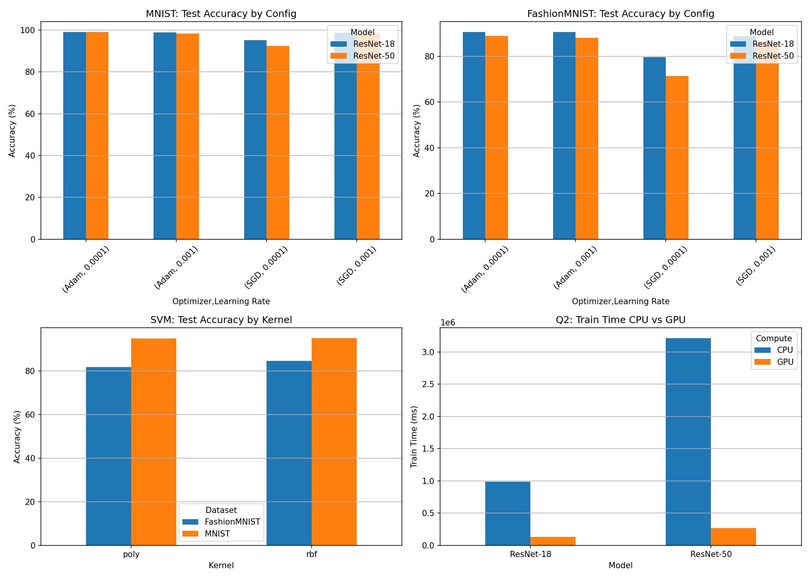

# MLOps Assignment 1

**Name:** Tejas Gupta
**Roll Number:** B22CS093
**Branch:** Assignment1

---

## Kaggle Notebooks

- [Part 1: MNIST](https://www.kaggle.com/code/tejasgupta001/part1-mnist)
- [Part 2: FashionMNIST](https://www.kaggle.com/code/tejasgupta001/part2-fashionmnist)
- [Part 3: SVM + CPU/GPU](https://www.kaggle.com/code/tejasgupta001/part3-svm-cpu-gpu)

---

## Q1(a): Deep Learning Classification Results

### MNIST Dataset (Epochs=2)

| BS | Optimizer | LR | pin_memory | ResNet-18 (%) | ResNet-50 (%) |
|:--:|:---------:|:------:|:----------:|:-------------:|:-------------:|
| 16 | SGD | 0.001 | True | 98.51 | 98.54 |
| 16 | SGD | 0.001 | False | 98.73 | 98.67 |
| 16 | SGD | 0.0001 | True | 95.16 | 92.43 |
| 16 | SGD | 0.0001 | False | 92.21 | 90.38 |
| 16 | Adam | 0.001 | True | 97.80 | 98.35 |
| 16 | Adam | 0.001 | False | 98.65 | 98.44 |
| 16 | Adam | 0.0001 | True | 98.91 | **99.06** |
| 16 | Adam | 0.0001 | False | 98.80 | 98.70 |
| 32 | SGD | 0.001 | True | 97.69 | 97.78 |
| 32 | SGD | 0.001 | False | 97.95 | 98.14 |
| 32 | SGD | 0.0001 | True | 69.20 | 71.24 |
| 32 | SGD | 0.0001 | False | 90.17 | 64.18 |
| 32 | Adam | 0.001 | True | 98.47 | 97.18 |
| 32 | Adam | 0.001 | False | 97.66 | 98.09 |
| 32 | Adam | 0.0001 | True | 98.02 | 98.60 |
| 32 | Adam | 0.0001 | False | **99.12** | 98.63 |

**Best MNIST Accuracy: 99.12% (ResNet-18, BS=32, Adam, LR=0.0001, Epochs=2, pin_memory=False)**

### FashionMNIST Dataset (Epochs=2)

| BS | Optimizer | LR | pin_memory | ResNet-18 (%) | ResNet-50 (%) |
|:--:|:---------:|:------:|:----------:|:-------------:|:-------------:|
| 16 | SGD | 0.001 | True | 88.86 | 84.97 |
| 16 | SGD | 0.001 | False | 88.55 | 86.17 |
| 16 | SGD | 0.0001 | True | 79.74 | 70.73 |
| 16 | SGD | 0.0001 | False | 76.95 | 71.36 |
| 16 | Adam | 0.001 | True | 89.02 | 87.09 |
| 16 | Adam | 0.001 | False | **90.57** | 87.03 |
| 16 | Adam | 0.0001 | True | 89.82 | **88.94** |
| 16 | Adam | 0.0001 | False | **90.67** | 87.54 |
| 32 | SGD | 0.001 | True | 85.22 | 83.34 |
| 32 | SGD | 0.001 | False | 86.16 | 83.31 |
| 32 | SGD | 0.0001 | True | 74.32 | 65.31 |
| 32 | SGD | 0.0001 | False | 75.13 | 67.94 |
| 32 | Adam | 0.001 | True | 89.50 | 88.18 |
| 32 | Adam | 0.001 | False | 87.43 | 88.14 |
| 32 | Adam | 0.0001 | True | 90.51 | 88.25 |
| 32 | Adam | 0.0001 | False | 88.55 | 87.59 |

**Best FashionMNIST Accuracy: 90.67% (ResNet-18, BS=16, Adam, LR=0.0001, Epochs=2, pin_memory=False)**

### Effect of Epochs

| Dataset | Model | Epochs | pin_memory | Avg Test Accuracy (%) | Avg Train Time (ms) |
|:-------:|:-----:|:------:|:----------:|:---------------------:|:-------------------:|
| MNIST | ResNet-18 | 1 | False | 93.15 | 54,598 |
| MNIST | ResNet-18 | 1 | True | 93.96 | 50,037 |
| MNIST | ResNet-18 | 2 | False | 96.35 | 167,678 |
| MNIST | ResNet-18 | 2 | True | 93.97 | 142,488 |
| MNIST | ResNet-50 | 1 | False | 88.09 | 165,216 |
| MNIST | ResNet-50 | 1 | True | 85.92 | 160,492 |
| MNIST | ResNet-50 | 2 | False | 93.03 | 357,185 |
| MNIST | ResNet-50 | 2 | True | 94.18 | 376,015 |
| FashionMNIST | ResNet-18 | 1 | False | 82.97 | 82,047 |
| FashionMNIST | ResNet-18 | 1 | True | 82.75 | 71,405 |
| FashionMNIST | ResNet-18 | 2 | False | 86.50 | 172,594 |
| FashionMNIST | ResNet-18 | 2 | True | 86.81 | 150,092 |
| FashionMNIST | ResNet-50 | 1 | False | 74.48 | 184,435 |
| FashionMNIST | ResNet-50 | 1 | True | 76.65 | 159,364 |
| FashionMNIST | ResNet-50 | 2 | False | 81.26 | 393,513 |
| FashionMNIST | ResNet-50 | 2 | True | 82.35 | 259,698 |

### Effect of pin_memory on Training Time

| Dataset | Model | pin_memory | Avg Train Time (ms) | Speedup |
|:-------:|:-----:|:----------:|:-------------------:|:-------:|
| MNIST | ResNet-18 | False | 111,138 | - |
| MNIST | ResNet-18 | True | 96,263 | 1.15x |
| MNIST | ResNet-50 | False | 261,201 | - |
| MNIST | ResNet-50 | True | 268,254 | 0.97x |
| FashionMNIST | ResNet-18 | False | 127,321 | - |
| FashionMNIST | ResNet-18 | True | 110,749 | 1.15x |
| FashionMNIST | ResNet-50 | False | 288,974 | - |
| FashionMNIST | ResNet-50 | True | 209,531 | 1.38x |

---

## Q1(b): SVM Classification Results

### MNIST Dataset

| Kernel | Configuration | Test Accuracy (%) | Train Time (ms) |
|:------:|:-------------:|:-----------------:|:---------------:|
| poly | degree=2, C=1.0 | 95.69 | 4808.81 |
| poly | degree=3, C=1.0 | 95.15 | 3654.25 |
| poly | degree=4, C=1.0 | 93.53 | 4407.84 |
| rbf | gamma=scale, C=1.0 | 95.94 | 4511.97 |
| rbf | gamma=auto, C=1.0 | 92.13 | 6359.34 |
| rbf | gamma=0.01, C=1.0 | 95.33 | 4209.30 |
| rbf | gamma=scale, C=10.0 | **96.84** | 3057.90 |

### FashionMNIST Dataset

| Kernel | Configuration | Test Accuracy (%) | Train Time (ms) |
|:------:|:-------------:|:-----------------:|:---------------:|
| poly | degree=2, C=1.0 | 83.78 | 3062.35 |
| poly | degree=3, C=1.0 | 81.66 | 4770.23 |
| poly | degree=4, C=1.0 | 79.55 | 3673.91 |
| rbf | gamma=scale, C=1.0 | 85.31 | 4021.25 |
| rbf | gamma=auto, C=1.0 | 80.90 | 4672.42 |
| rbf | gamma=0.01, C=1.0 | 85.31 | 3588.89 |
| rbf | gamma=scale, C=10.0 | **86.67** | 3598.22 |

---

## Q2: CPU vs GPU Performance (FashionMNIST)

### Test Classification Accuracy (%)

| Compute | Batch Size | Optimizer | LR | ResNet-18 | ResNet-50 |
|:-------:|:----------:|:---------:|:--:|:---------:|:---------:|
| CPU | 16 | SGD | 0.001 | 86.72 | 79.57 |
| CPU | 16 | Adam | 0.001 | 87.40 | 78.31 |
| GPU | 16 | SGD | 0.001 | 82.90 | 81.08 |
| GPU | 16 | Adam | 0.001 | 85.79 | 83.63 |

### Train Time (ms)

| Compute | Batch Size | Optimizer | LR | ResNet-18 | ResNet-50 |
|:-------:|:----------:|:---------:|:--:|:---------:|:---------:|
| CPU | 16 | SGD | 0.001 | 1,091,207 | 3,553,911 |
| CPU | 16 | Adam | 0.001 | 877,261 | 2,876,219 |
| GPU | 16 | SGD | 0.001 | 131,726 | 256,009 |
| GPU | 16 | Adam | 0.001 | 132,498 | 273,975 |

### FLOPs

| Model | FLOPs |
|:-----:|:-----:|
| ResNet-18 | 1.82 Billion |
| ResNet-50 | 4.13 Billion |

### GPU Speedup

| Model | CPU Time (ms) | GPU Time (ms) | Speedup |
|:-----:|:-------------:|:-------------:|:-------:|
| ResNet-18 | 984,234 | 132,112 | **7.45x** |
| ResNet-50 | 3,215,065 | 264,992 | **12.13x** |

---

## Configuration

- **Split:** 70% Train / 10% Val / 20% Test
- **USE_AMP:** True
- **Image Size:** 224 x 224
- **Epochs:** 1, 2

---

## Training Curves

Sample training curves are available in the Kaggle notebooks.

---

**Report:** [B22CS093_TejasGupta_Ass1.pdf](Report/B22CS093_TejasGupta_Ass1.pdf)
